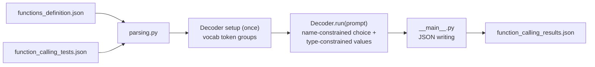

*This project has been created as part of the 42 curriculum by tlaghzal.*

## Description

Call Me Maybe is a mandatory 42 project about function calling with a small LLM.
The program receives natural-language prompts and a list of available function
definitions, then writes a JSON array describing which function should be called
and which typed parameters should be passed to it.

Example output object:

```json
{
  "prompt": "What is the sum of 40 and 2?",
  "name": "fn_add_numbers",
  "parameters": {"a": 40.0, "b": 2.0}
}
```

The important part is that the model is not asked to freely write JSON. The code
uses constrained decoding so each generated token must keep the output inside
the allowed function names and parameter value types.

## How It Works



At each generation step the model produces logits for every token in the
vocabulary; the decoder sets every invalid token to negative infinity and takes
the argmax of what remains. JSON structure (braces, quotes, keys, commas) is
never generated — it is written directly, and the model is only consulted where
there is a real choice:


- **Function name** — constrained to the token paths of the declared function
  names, stored in a token trie (`trie.py`); the model is only called where
  names diverge.
- **Boolean** — the same trie mechanism over exactly `true` / `false`.
- **Integer / number** — digits, an optional leading minus, at most one dot;
  stopping is itself a constrained choice of an end token.
- **String** — any token without a quote is content; generation stops when a
  quote-bearing token beats the best content token.

## Instructions

### Installation

Install dependencies with:

```bash
make install
```

The reviewer/moulinette can also just run `uv sync` directly, as required by
the subject.

### Execution

Run the default input files:

```bash
make run
```

Equivalent direct command:

```bash
uv run python -m src \
  --functions_definition data/input/functions_definition.json \
  --input data/input/function_calling_tests.json \
  --output data/output/function_calling_results.json
```

The output directory is generated at runtime and is ignored by git.

#### Bonus flags

```bash
# Print each generation step (function choice, each parameter value) to
# stderr as it is produced (bonus: visualization of the generation process)
uv run python -m src --verbose

# Pick which model to run (bonus: multiple LLM models); defaults to
# Qwen/Qwen3-0.6B if omitted
uv run python -m src --model Qwen/Qwen2.5-0.5B-Instruct
```

`--model` is restricted to `MODEL_CHOICES` in `src/__main__.py`
(`Qwen/Qwen3-0.6B`, the subject's required default, and
`Qwen/Qwen2.5-0.5B-Instruct` as a second option) so an invalid model id is
rejected by argparse itself before any network call is made.

### Debugging

```bash
make debug
```

### Linting

```bash
make lint
make lint-strict   # optional, mypy --strict
```

### Cleaning Up

```bash
make clean
```

## Algorithm Explanation

The decoder follows the subject's mandatory constrained-decoding idea:

1. The program loads and validates both input JSON files with pydantic models.
2. `Decoder.__init__` reads the vocabulary file once and groups the token ids
   needed by the constraints: digit tokens, tokens containing a quote, tokens
   without one, the dot, the minus sign, and the tokens allowed to end a
   number.
3. The JSON structure itself (`{"name": "`, `", "parameters": {`, `"key": `,
   `, `, `}}`) is appended by the code with no model call. The model is asked
   only where there is a real choice, through one helper — `pick(allowed)` —
   which fetches the logits, sets every token outside `allowed` to negative
   infinity, and returns the argmax.
4. The function name is selected with `choose()`: every declared name is
   encoded into a token trie (`trie.py`), and at each step only the ids that
   continue at least one still-possible name are allowed, following the trie
   down to a leaf.
5. Boolean parameters reuse `choose()` over exactly `true` and `false`.
6. Number and integer parameters are constrained to tokens that keep a valid
   numeric prefix (optional leading minus, digits, at most one dot for
   floats). Stop tokens are only allowed after at least one digit.
7. String parameters are generated inside a JSON string context; generation
   stops when the best quote-bearing token beats the best content token.
8. The final file is written with `json.dump`, so the produced file is always
   valid JSON and contains only the required keys: `prompt`, `name`, and
   `parameters`.

The function choice comes from the LLM logits under a token constraint. The code
does not choose functions with keyword rules or hardcoded examples.

## Design Decisions

- Pydantic is used for all project classes that hold structured data.
- The code is split by responsibility:
  - `decoder.py` — `Decoder` class: the whole constrained generation loop.
  - `vocab.py` — `Vocab` class: cached tokenizer encode/decode plus the
    digit/quote/plain/end token-id groups derived from the vocab file.
  - `trie.py` — `Trie`/`TrieNode`: the token-id structure `choose()` walks
    to pick between a fixed set of options (function names, booleans).
  - `parsing.py` — input loading and pydantic schema validation.
  - `__main__.py` — CLI entry point, orchestration, and JSON file writing.
- The `Decoder` is created once per run (it builds a `Vocab` in `__init__`,
  which does the vocab-file parsing/validation once) and `run(prompt)` is
  called for each prompt.
- Simplicity over micro-optimization: there is a single generic constrained
  step (`pick`) and a small set of value generators on top of it
  (`gen_string`, `gen_number`), dispatched from one place (`gen_value`)
  instead of a separate grammar-compilation layer.
- The model is chosen from a small closed list (`MODEL_CHOICES` in
  `__main__.py`, enforced by `argparse(choices=...)`) rather than an
  arbitrary free-text `--model` value: the subject only guarantees the
  pipeline works with `Qwen/Qwen3-0.6B`, so letting the CLI accept literally
  any string would invite hard-to-diagnose failures deep inside
  `Small_LLM_Model`. A second model is offered as the multi-model bonus
  without opening that door.
- The provided SDK is used through public methods only. No project code
  imports `torch`, `transformers`, or `huggingface_hub` directly — only the
  provided `llm_sdk` package depends on them, per the subject's restriction.
- Errors from missing files, invalid JSON, model initialization, and generation
  are caught and reported clearly, with a non-zero exit code on failure. The
  top-level handler in `__main__.py` deliberately catches `Exception`, not
  `BaseException` — catching `BaseException` would also swallow the
  `SystemExit` raised by `sys.exit(1)` inside `main()` and silently turn every
  intended failure into a success exit code, which is exactly the bug this
  project avoids.
- `Vocab.__init__` validates the loaded vocabulary itself (must be a
  non-empty object, must contain digit/quote/plain tokens, must produce a
  token for each fixed JSON separator), and `Decoder._check_name_collisions`
  rejects function names whose token encoding is a strict prefix of
  another's — turning several classes of silent wrong output or deep
  crashes (empty-sequence `argmax`, `KeyError` on an untraversed trie
  branch) into one clear startup error instead.

## File Organization

```
src/
├── __main__.py   — CLI entry point, orchestration, and JSON file writing
├── parsing.py    — pydantic models + JSON input loading
├── vocab.py      — Vocab class: tokenizer encode/decode (cached) plus the
│                   digit/quote/plain/end token-id groups used to mask logits
├── decoder.py    — Decoder class: constrained token-by-token generation
└── trie.py       — token trie used by Decoder.choose()
```

## Bonus Features

Five bonus features are implemented and working (not just described):

1. **Multiple LLM models** (`--model`) — `MODEL_CHOICES` in `__main__.py`
   lists `Qwen/Qwen3-0.6B` (the required default) and
   `Qwen/Qwen2.5-0.5B-Instruct` as a second option, enforced by
   `argparse(choices=...)`. `Decoder` and the constrained-decoding logic
   are entirely model-agnostic — they only use `get_path_to_vocab_file`,
   `encode`, `decode`, and `get_logits_from_input_ids` from the SDK — so
   switching models needed no changes outside the CLI flag itself. Verified
   by running the full pipeline against both choices (see Performance
   Analysis).
2. **Visualization of the generation process** (`--verbose`) — `Decoder.log()`
   prints the chosen function name and every parameter value to stderr as
   soon as it is produced, so the token-by-token decision process is
   observable while it runs.
3. **Performance optimization (caching)** — `Decoder.encode()` caches results
   per literal string. The fixed JSON scaffolding (`", "parameters": {`,
   key names, function names, `true`/`false`) is identical on every prompt,
   so re-encoding it on each of the N prompts is wasted tokenizer work;
   caching removes that redundancy.
4. **Advanced error recovery** — generation is bounded (`MAX_STRING_TOKENS`,
   `MAX_NUMBER_TOKENS`) so a stubborn model can never hang or corrupt the
   JSON; a number with no digit falls back to `0` instead of raising; each
   prompt is processed independently in `__main__.py`, so one bad prompt is
   logged to stderr and skipped without stopping the batch; every I/O,
   parsing, model-initialization, and per-prompt generation failure is
   caught and reported with a clear message and a correct non-zero exit
   code (see the `SystemExit` note above, and the vocab/name-collision
   checks in Design Decisions).
5. **Demonstration of how encoding and decoding integrate with constrained
   decoding** — with `--verbose`, `pick()` logs how many token ids were
   `allowed` (built from `vocab.encode()`-derived groups), the raw
   `get_logits_from_input_ids` call, the masking, and the winning token id
   plus its `vocab.decode()`-ed text; `_emit()` logs the same decode step
   for every accepted token; and `gen_string()`'s own inline
   closing-quote-vs-content comparison logs which token would have
   continued the string before it loses to the quote. Together these make
   every step of encode → logits → mask → argmax → decode → append visible
   at runtime, not just described in prose. Example, generating
   `{"a": 2.0, ...}` for "What is the sum of 2 and 3?":
   ```
   pick: 14 allowed token(s) -> chose id 17 ('2')
   emit: id 17 decodes to '2'
   pick: 18 allowed token(s) -> chose id 11 (',')
   a = 2.0
   ```
   (the last `pick` chose a stop signal, not a digit — see Challenges Faced
   for why there's no matching `emit` line for it.)

## Performance Analysis

Measured on `data/input/function_calling_tests.json` (11 prompts, 5
functions, CPU only):

- **Accuracy**: with the default `Qwen/Qwen3-0.6B`, 11/11 prompts produced
  the correct function name and correctly typed arguments. With
  `--model Qwen/Qwen2.5-0.5B-Instruct`, 10/11 (91%): it misread the regex
  prompt `"Replace all numbers in ... with NUMBERS"` as `fn_add_numbers`
  instead of `fn_substitute_string_with_regex` — a genuine reasoning
  difference between the two models, not a decoding failure, since the
  output was still valid, schema-compliant JSON for the (wrong) function it
  picked. Both stay at or above the subject's 90%+ target.
- **JSON validity**: 100% for both models — the output file is written by
  Python's `json` module from already-typed Python values, so it is always
  syntactically valid and schema-compliant by construction, not by post-hoc
  checking, regardless of which function was chosen.
- **Speed**: around 74-170 seconds total for 11 prompts on CPU across
  several runs and both models (well under the 5-minute budget), including
  model load time. Structural JSON tokens and forced name tokens are
  appended without a forward pass, and repeated literal encodes are cached
  (bonus 3), so the model is only called where the output genuinely
  branches.

## Challenges Faced & Solutions

- Small models often produce invalid JSON when prompted normally. The solution
  is to never ask the model to freely write the final object — only the parts
  that are a genuine choice go through the model.
- Tokenizers can split words and punctuation in surprising ways. The allowed
  name paths are built with the SDK's own `encode` method so they match the
  model vocabulary exactly, using a trie so shared prefixes only cost one
  model call.
- An early version wrapped the whole CLI in `except BaseException`, which also
  catches `SystemExit`. This silently converted every intended `sys.exit(1)`
  error into a printed `1` and a **successful** exit code — a serious bug for
  a program whose failure paths are graded. Fixed by narrowing the top-level
  guard to `except Exception`, verified with `echo $?` after triggering a
  missing-file, malformed-JSON, and unknown-model error.
- Input files may be missing or malformed. Parsing code catches JSON errors and
  validation errors and turns them into readable messages.
- Several deeper crash surfaces were only reachable with an unusual vocab or
  function set, not the provided example data: an empty `quote_ids`/
  `plain_ids` list would make `np.argmax` raise on an empty sequence inside
  `gen_string`; a non-dict or empty vocab file would raise `AttributeError`
  instead of a clear message; and two function names where one is a token
  prefix of the other (e.g. `fn_get` / `fn_get_all`) would make `choose()`
  silently stop at the shorter name forever, since it exits as soon as it
  reaches *any* complete option. All three are now checked explicitly in
  `Decoder.__init__`/`choose()` and turned into a clear `ValueError` instead
  of a crash or silent wrong answer.
- In `gen_number`, the token that ends the loop (a comma, `}`, space, or
  newline) is only ever used as a stop *signal* — `if token in
  self.vocab.end_ids: break` happens before `_emit()` would append it. It is
  never written into `self.ids` or the accumulated text. The actual
  separator that ends up in the output JSON comes from `run()`'s own fixed
  `self.add(", ")` / `self.add("}}")` afterward, not from decoding whatever
  stop token the model happened to pick. That is why the `--verbose` trace
  shows a `pick: ... chose id 11 (',')` line with no matching `emit:` line
  right after it: the model only needs to signal "stop", and the code
  guarantees the exact correct punctuation regardless of which of the four
  recognized stop tokens it chose.
- This machine has no NVIDIA GPU/driver, but the default PyPI `torch` wheel
  is the CUDA build, which preloads its bundled CUDA runtime `.so` files at
  import time via `ctypes.CDLL` — on a cold disk cache this can take tens of
  seconds and looks exactly like a hang. `pyproject.toml` pins `torch` to
  the CPU-only wheel index (`https://download.pytorch.org/whl/cpu`) via
  `[tool.uv.sources]`/`[[tool.uv.index]]`, which skips that step entirely.

## Testing Strategy

No automated test suite is included; validation was done by hand, end to
end, against the real model on every change:

1. `make lint` and `make lint-strict` — flake8 and mypy (including
   `--strict`) both pass with zero issues.
2. `make run` — full pipeline against the provided input files; verified the
   output is a JSON array, each object has exactly `prompt`, `name`, and
   `parameters`, and all 11 prompts resolved to the correct function and
   correctly typed arguments.
3. The same run repeated with `--model Qwen/Qwen2.5-0.5B-Instruct` and with
   `--verbose`, to confirm both bonus flags actually change behavior rather
   than being dead CLI options.
4. Error paths verified by hand, checking both the stderr message and the
   process exit code: missing input file, malformed JSON, and a model that
   fails to load — all exit `1` with a clear message and no raw traceback.
   An invalid `--model` value is rejected by argparse itself before any
   network call. An empty prompts array was also verified to produce a
   valid empty `[]` output instead of crashing.

## Resources

- Pydantic documentation: https://docs.pydantic.dev/
- Python argparse documentation: https://docs.python.org/3/library/argparse.html
- Python json documentation: https://docs.python.org/3/library/json.html
- Qwen3 model family: https://huggingface.co/Qwen
- AI usage: AI was used to review the subject requirements, restore and
  simplify the decoder/CLI after an in-progress refactor had left them
  broken (a bogus per-character `encode()` assertion and a half-finished
  `Vocab` class that didn't match `Decoder`'s constructor), find and fix the
  `except BaseException` / `SystemExit` exit-code bug and the other crash
  surfaces described above, wire up a `--model` flag that had been added to
  the CLI but never actually connected to model loading, add the five bonus
  features, and update this README. A pytest suite was written at one point
  and later removed by request in favor of the encoding/decoding
  demonstration bonus, which needed no new dependency. Every change was run
  end-to-end against both `Qwen/Qwen3-0.6B` and `Qwen/Qwen2.5-0.5B-Instruct`
  and verified (lint, `mypy --strict`, and a full pipeline run producing
  correct output) before being accepted.
