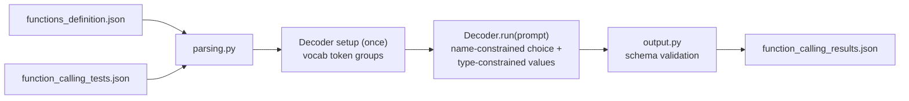
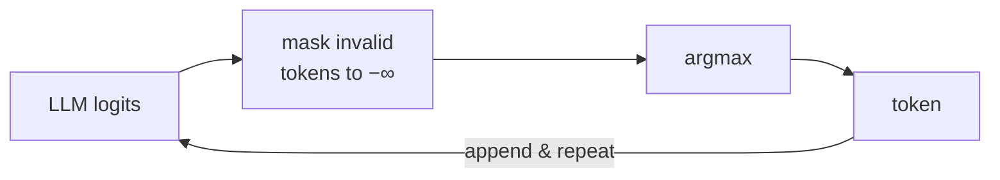

*This project has been created as part of the 42 curriculum by tlaghzal.*

## Description

Call Me Maybe is a mandatory 42 project about function calling with a small LLM.
The program receives natural-language prompts and a list of available function
definitions, then writes a JSON array describing which function should be called
and which typed parameters should be passed to it.

Example output object:

```json
{
  "prompt": "What is the sum of 40 and 2?",
  "name": "fn_add_numbers",
  "parameters": {"a": 40.0, "b": 2.0}
}
```

The important part is that the model is not asked to freely write JSON. The code
uses constrained decoding so each generated token must keep the output inside
the allowed function names and parameter value types.

## How It Works



At each generation step the model produces logits for every token in the
vocabulary; the decoder sets every invalid token to negative infinity and takes
the argmax of what remains. JSON structure (braces, quotes, keys, commas) is
never generated — it is written directly, and the model is only consulted where
there is a real choice:



- **Function name** — constrained to the token paths of the declared function
  names; the model is only called where names diverge.
- **Boolean** — the same mechanism over exactly `true` / `false`.
- **Integer / number** — digits, an optional leading minus, at most one dot;
  stopping is itself a constrained choice of an end token.
- **String** — any token without a quote is content; generation stops when a
  quote-bearing token beats the best content token.

## Instructions

### Installation

Install dependencies with:

```bash
make install
```

### Execution

Run the default input files:

```bash
make run
```

Equivalent direct command:

```bash
uv run python -m src --functions_definition data/input/functions_definition.json --input data/input/function_calling_tests.json --output data/output/function_calling_results.json
```

The output directory is generated at runtime and is ignored by git.

### Debugging

```bash
make debug
```

### Linting

```bash
make lint
```

### Cleaning Up

```bash
make clean
```

## Algorithm Explanation

The decoder follows the subject's mandatory constrained-decoding idea:

1. The program loads and validates both input JSON files with pydantic models.
2. `Decoder.__init__` reads the vocabulary file once and groups the token ids
   needed by the constraints: digit tokens, tokens containing a quote, tokens
   without one, the dot, the minus sign, and the tokens allowed to end a
   number.
3. The JSON structure itself (`{"name": "`, `", "parameters": {`, `"key": `,
   `, `, `}}`) is appended by the code with no model call. The model is asked
   only where there is a real choice, through one helper — `pick(allowed)` —
   which fetches the logits, sets every token outside `allowed` to negative
   infinity, and returns the argmax.
4. The function name is selected with `choose()`: every declared name is
   encoded to token ids, and at each step only the ids that continue a still
   possible name are allowed; names that don't match the picked token are
   dropped until one remains.
5. Boolean parameters reuse `choose()` over exactly `true` and `false`.
6. Number and integer parameters are constrained to tokens that keep a valid
   numeric prefix (optional leading minus, digits, at most one dot for
   floats). Stop tokens are only allowed after at least one digit.
7. String parameters are generated inside a JSON string context; generation
   stops when the best quote-bearing token beats the best content token.
8. The final file is written with `json.dump`, so the produced file is always
   valid JSON and contains only the required keys: `prompt`, `name`, and
   `parameters`.

The function choice comes from the LLM logits under a token constraint. The code
does not choose functions with keyword rules or hardcoded examples.

## Design Decisions

- Pydantic is used for all project classes that hold structured data.
- The code is split by responsibility:
  - `decoder.py` — `Decoder` class: the whole constrained generation loop.
  - `parsing.py` / `output.py` — I/O and schema validation.
- The `Decoder` is created once per run (vocabulary token groups are built in
  `__init__`) and `run(prompt)` is called for each prompt.
- Simplicity over micro-optimization: there is a single generic constrained
  step (`pick`) and three small value generators on top of it, instead of a
  separate grammar-compilation layer.
- The implementation stays inside the mandatory subject. It does not implement
  bonus tokenizer recoding, model switching, batching, visualization, or nested
  argument support.
- The provided SDK is used through public methods only.
- Errors from missing files, invalid JSON, model initialization, and generation
  are caught and reported clearly.

## File Organization

```
src/
├── __main__.py   — CLI entry point and orchestration
├── parsing.py    — pydantic models + JSON input loading
├── decoder.py    — Decoder class: constrained token-by-token generation
└── output.py     — schema validation + JSON file writing
```

## Performance Analysis

- JSON validity: the output file is written by Python's JSON module.
- Schema reliability: function names are constrained to declared functions, and
  parameter values are constrained by declared primitive types.
- Accuracy target: the subject asks for 90%+ function and argument accuracy.
  The name and type constraints improve reliability compared with prompt-only
  JSON generation, while the final quality still depends on the small model
  logits.
- Speed: prompts are processed sequentially. The model is only called where
  the output genuinely branches — structural JSON tokens and forced name
  tokens are appended without a forward pass.

## Challenges Faced & Solutions

- Small models often produce invalid JSON when prompted normally. The solution is
  to never ask the model to freely write the final object.
- Tokenizers can split words and punctuation in surprising ways. The allowed
  name paths are built with the SDK's own `encode` method so they match the
  model vocabulary exactly.
- Input files may be missing or malformed. Parsing code catches JSON errors and
  validation errors and turns them into readable messages.

## Testing Strategy

Testing should include:

1. `make lint`
2. `make run`
3. Check that `data/output/function_calling_results.json` exists.
4. Validate that the output is a JSON array.
5. Confirm each object contains exactly `prompt`, `name`, and `parameters`.
6. Try malformed JSON and missing file paths to verify clear error messages.

## Resources

- Pydantic documentation: https://docs.pydantic.dev/
- Python argparse documentation: https://docs.python.org/3/library/argparse.html
- Python json documentation: https://docs.python.org/3/library/json.html
- Qwen3 model family: https://huggingface.co/Qwen
- AI usage: AI was used to review the subject requirements, simplify the code
  organization, improve wording in this README, and check for lint/type issues.
