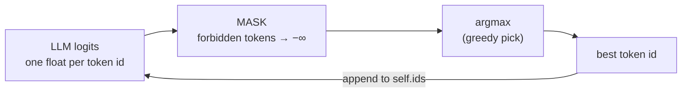

# 00 — Overview & Reading Order

This folder explains the project **one file at a time**. Each document covers the
same six things for its file:

1. **Role** — one sentence.
2. **Theory** — the idea behind it.
3. **Inputs / Outputs** — what goes in, what comes out.
4. **How it works** — a walkthrough of the code.
5. **Why this design** — rationale and rejected alternatives.
6. **How to reimplement** — steps to rebuild it from scratch.

## The problem we are solving

A small language model (Qwen3-0.6B) is given a natural-language request such as
*"What is the sum of 2 and 3?"*. We must output a **function call** as JSON:

```json
{"prompt": "What is the sum of 2 and 3?",
 "name": "fn_add_numbers",
 "parameters": {"a": 2.0, "b": 3.0}}
```

Small models are unreliable at producing valid JSON if you just ask them. So we
use **constrained decoding**: we generate token by token and, at every step,
forbid any token that would break JSON structure or the function's type schema.

## The one big idea: forced vs. free positions

While building the JSON, every position is one of two kinds:

- **Forced** — only one token is ever valid (the `{`, the `"`, the `:` between a
  key and its value). We just *write* these ourselves; running the model would
  only confirm the single legal choice.
- **Free** — the model genuinely chooses: *which* function, *which* digits,
  *which* string text. Here we run the model, mask the logits down to the valid
  tokens, and let it pick.

So: **structure is forced, content is masked.** This guarantees 100% valid JSON
and lets the model make only the choices that matter.

---

## Full pipeline

```mermaid
flowchart TD
    FD[functions_definition.json] -->|parse_functions| F["Dict[name, FunctionDefinition]"]
    TI[function_calling_tests.json] -->|parse_prompts| P["List[Prompt]"]

    subgraph startup ["Startup — once per run (Decoder.__init__)"]
        LLM[Small_LLM_Model] --> D[Decoder]
        F --> D
        D --> V["token-id sets<br/>(digits, dot, minus,<br/>end tokens, quote tokens)"]
        D --> FT["function-name trie"]
        D --> BT["boolean trie (true/false)"]
        D --> B["functions text block<br/>(injected into every prompt)"]
    end

    subgraph perprompt ["Per prompt — Decoder.run(prompt)"]
        S1["encode(INSTRUCTION + '&#123;&quot;name&quot;: &quot;')"] --> S2["_walk(function trie)<br/>model picks the function name"]
        S2 --> S3["emit('&quot;, &quot;parameters&quot;: &#123;')"]
        S3 --> S4{"for each parameter<br/>(schema order)"}
        S4 -->|string| V1["_string()<br/>stop when a quote token wins"]
        S4 -->|boolean| V2["_walk(boolean trie)<br/>true or false only"]
        S4 -->|integer / number| V3["_number()<br/>digits, sign, one dot;<br/>stop on end token"]
        V1 --> S4
        V2 --> S4
        V3 --> S4
        S4 -->|done| S5["emit('&#125;&#125;')  →  JsonObject"]
    end

    P --> perprompt
    startup --> perprompt
    S5 --> VAL["validate_result()<br/>strict pydantic schema check"]
    VAL --> W["write_results()<br/>json.dump → guaranteed valid JSON"]
    W --> OUT[data/output/function_calling_results.json]
```



## Constrained decoding — how a single step works



What counts as "valid" depends on the current generation context:

| Context | Valid tokens |
|---------|--------------|
| function name | children of the current trie node |
| boolean value | children of the current trie node (`true` / `false`) |
| string content | all tokens whose text does **not** contain `"` |
| string close | best token among those that **do** contain `"` (any prefix before the `"` is salvaged into the string) |
| integer digit | digit-only tokens; minus only at position 0 |
| number digit | digit tokens; minus at position 0; one dot after a digit |
| number/integer end | end tokens (`,` `}` `]` space, newline) once at least one digit exists |

---

## Reading order

```
input files ─▶ parsing ─▶ Decoder setup (tries + token sets) ─▶ for each prompt:
                                                                   Decoder.run()
                                                                   ├─ pick name (trie)
                                                                   └─ decode each value
                                                               ─▶ validate ─▶ write JSON
```

Read the files in this order:

| Doc | File | What it adds |
|-----|------|--------------|
| [01](01-parsing.md) | `src/parsing.py` | Load & validate the input JSON files |
| [02](02-trie.md) | `src/trie.py` | Trie data structure for fixed-choice tokens |
| [03](03-decoder.md) | `src/decoder.py` | Vocab sets, logit masking, and the per-prompt generation loop |
| [04](04-output.md) | `src/output.py` | Validate against schema + write file |
| [05](05-main.md) | `src/__main__.py` | CLI and orchestration |

`src/__init__.py` only marks `src` as a package so `python -m src` works.

## Rules we respect (from the subject)

- Constrained decoding via **logit masking**, never "prompt and hope".
- The function is chosen **by the model**, not by keyword heuristics.
- Only **public** `llm_sdk` methods are used.
- All data classes use **pydantic**; code passes **flake8** and **mypy**.
- Output is **always valid JSON** matching the schema.
