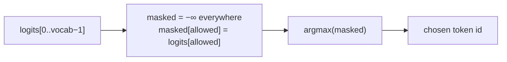
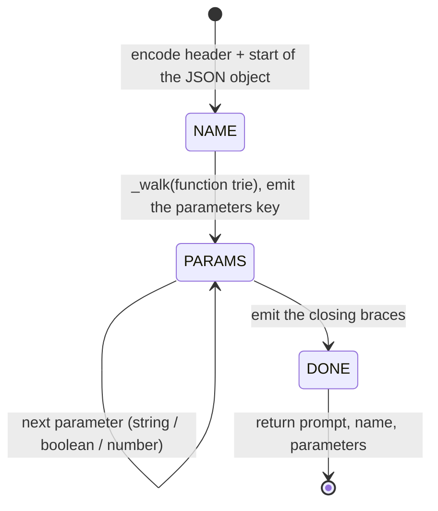

# 03 — `src/decoder.py`

## Role

The engine. One `Decoder` class that is set up **once per run** (vocabulary token
sets, tries, functions text block) and then builds **one function call per
prompt** by extending a single token sequence, running the model only where there
is a real choice and masking the logits so only valid tokens can be picked.

## Theory

### One growing sequence ("track and continue")

The model is autoregressive: to predict the next token it needs the whole
sequence so far. We keep one list, `self.ids`, and **only append** to it — the
instruction header, the function name, the value tokens, and the structural
tokens we write. We never rebuild or re-encode the prompt mid-generation, so the
sequence faithfully *continues* rather than being reconstructed.

### Structure is written, content is masked

We control the JSON shape, so we *write* the fixed parts (`{`, `"`, keys, `:`,
`,`, `}`) directly with `_emit()`. We only call the model for:

- the **function name** (constrained by the function trie), and
- each **value** (constrained by its declared type).

### Logit masking = constrained argmax

The subject defines constrained decoding as: the model produces logits for all
tokens; you set the logits of invalid tokens to `−∞`; you sample only from the
rest. We use greedy decoding, so `_pick(logits, allowed)` builds a `−∞` array,
copies in the logits of the allowed ids, and takes the global `argmax`.

### Generation phases

## Inputs / Outputs

- **`__init__(llm, functions)`** — the SDK model and the
  `Dict[str, FunctionDefinition]` from parsing.
- **`run(prompt) -> JsonObject`** — returns `{"prompt", "name", "parameters"}`
  as a Python dict, which the output stage turns into guaranteed-valid JSON.

## How it works

### Setup (`__init__`) — everything that is the same for every prompt

The vocabulary maps every token string to its id (`llm.get_vocab()`). Scanning
~150k tokens on every generated step would be far too slow, so the token-id sets
are precomputed once:

- `_digits` — tokens made only of digits (multi-digit tokens like `42` included).
- `_dot`, `_minus` — the `.` and `-` tokens (`-1` if absent from the vocab).
- `_end_ids` — tokens that legally end a number: `,` `}` `]` space, newline.
- `_quote_ids` — every token whose text **contains** `"` (`"`, `",`, `"}`, `)"`,
  …). These are the candidates for **closing** a string and are forbidden as
  plain string content.

Also built once:

- `_fn_trie` — a `Trie` over all function names (see [02](02-trie.md)).
- `_bool_trie` — a `Trie` over `true` / `false`.
- `_block` — the text listing each function (`- name(params): description`),
  injected into the instruction header of every prompt.

### Helpers

- `_emit(text)` — encode fixed text and append it to `self.ids`. No model call:
  these are forced structural tokens.
- `_logits()` — `llm.get_logits_from_input_ids(self.ids)`: next-token logits for
  the current sequence.
- `_pick(logits, allowed)` — the constrained argmax described above.

### `_walk(root)` — function name & boolean

Descends a trie. **Key optimization:** if the current node has exactly **one**
child, that token is *forced*, so we append it without calling the model. Only
at a real branch (2+ children) do we call `_logits()` and `_pick(...)` over the
children. Returns the word stored on the leaf. All function names share the
`fn_` prefix — that whole prefix is forced, so name selection costs a model call
only where the names actually diverge.

### `_string()`

Loops up to `_MAX_STRING` tokens. Each step compares the **best closing token**
(`_pick` over `_quote_ids`) against the **best content token** (argmax after
setting quote-bearing tokens to `−∞`). If closing wins, the string is finished;
otherwise append the content token and continue. The model usually closes with a
merged token like `",` or `"}`, so accepting *any* quote-bearing token as a
close is what stops it rambling. If the winning close token carries content
*before* the quote (e.g. `)` in `)"`), that prefix is salvaged into the string
value and emitted. The opening and closing quotes themselves are written by
`run()`, not here.

### `_number(integer_only)`

Tracks the text so far, `has_digit`, and `has_dot`. Each step builds the allowed
set: digits always; minus only while the text is empty; the dot only for
`number` (not `integer`), only after a digit, and only once; the **end tokens**
only once at least one digit exists — so the model can choose to stop. If the
pick is an end token, the number is done (it is not appended — the comma/brace
is structure). Finally parse to `int` (integer) or `float` (number); if no digit
was produced, default to `0.0`.

### `run(prompt)`

1. Encode the instruction header (functions block + request) followed by the
   literal `{"name": "` — so the model's very next prediction is the first token
   of a function name.
2. `_walk(self._fn_trie.root)` picks the name (fallback to the first function if
   the trie is empty), then `_emit('", "parameters": {')`.
3. For each parameter in schema order: `_emit('"key": ')`, then dispatch by
   type — `string → _string()` between emitted quotes, `boolean →
   _walk(self._bool_trie.root) == "true"`, otherwise `_number(...)` with
   `integer_only` set for `integer`. `_emit(", ")` between parameters.
4. `_emit("}}")` and return the dict.

## Why this design

- **Why one class instead of vocab / masking / context / state-machine
  modules?** Every piece (token sets, tries, helpers, decode loops) works on the
  same shared state — the model, the vocab sets, and `self.ids`. One class means
  the setup work is expressed as `__init__` and the per-prompt work as `run()`,
  with no plumbing types passed between modules.
- **Why write structure instead of masking it?** At a structural position only
  one token is valid; masking would force it anyway. Writing it is identical and
  skips a model call — the same "fast-forward forced tokens" trick as `_walk`.
- **Why build a dict and not emit raw JSON text?** A real dict + `json.dump`
  cannot produce malformed JSON. Structural validity is free.
- **Why stop a number with an "end token" choice (not by peeking at the
  unconstrained best)?** So termination is itself a constrained decision: the
  model picks from `digits ∪ end-tokens`, all valid. We never read an unmasked
  prediction.
- **Why caps (`_MAX_STRING`, `_MAX_NUMBER`)?** Safety: a degenerate model can
  never loop forever.

## Speed notes

The SDK recomputes the whole prefix on every `get_logits_from_input_ids` call
(no KV cache), so cost ≈ number of model calls. We minimize calls by:

- never calling the model for structure (only `_emit`),
- skipping forced (single-child) trie steps in `_walk`,
- allowing multi-digit tokens so numbers take fewer steps,
- deciding booleans in effectively one branching call.

## How to reimplement

1. In `__init__`, load the vocab and build the five token-id sets, the two
   tries, and the functions text block.
2. Write `_emit` (append encoded text), `_logits` (call the SDK), and `_pick`
   (mask to `−∞`, argmax).
3. Write `_walk` with the single-child fast-forward.
4. Write `_string` (compare best close vs. best content; salvage a prefix).
5. Write `_number` (numeric mask + end tokens; parse at the end).
6. Write `run` to encode the header, walk the name, loop the parameters
   dispatching by `schema.type`, and close with `}}`.

## Edge cases

- Model emits no digits for a number → value defaults to `0.0` (schema
  validation still passes for number/integer).
- A function with no parameters → the loop is skipped and `"parameters": {}` is
  produced.
- A string value containing a backslash (e.g. a regex) is allowed during
  generation and escaped correctly by `json.dump` at output time.
- `.` or `-` missing from the vocabulary → their ids are `-1` and simply never
  added to the allowed set.
