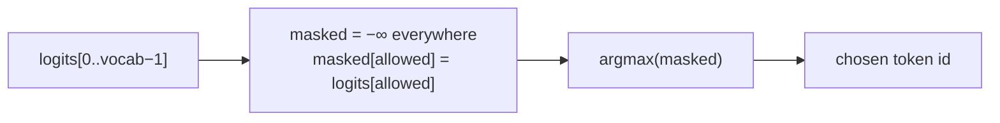
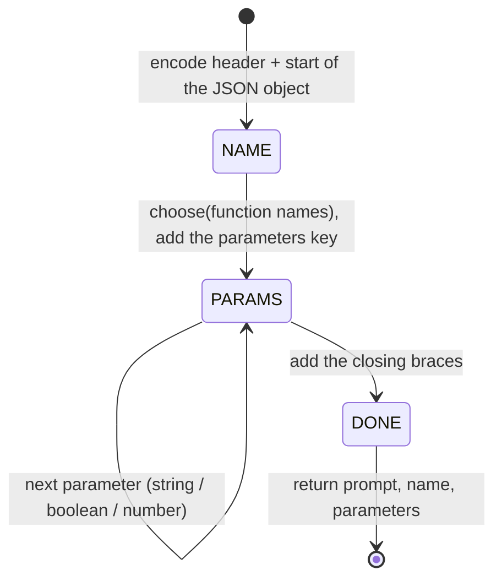

# 03 — `src/decoder.py`

## Role

The engine. One `Decoder` class that is set up **once per run** (vocabulary
token groups) and then builds **one function call per prompt** by extending a
single token sequence, running the model only where there is a real choice and
masking the logits so only valid tokens can be picked.

## Theory

### One growing sequence ("track and continue")

The model is autoregressive: to predict the next token it needs the whole
sequence so far. We keep one list, `self.ids`, and **only append** to it — the
instruction header, the function name, the value tokens, and the structural
tokens we write. We never rebuild or re-encode the prompt mid-generation, so the
sequence faithfully *continues* rather than being reconstructed.

### Structure is written, content is masked

We control the JSON shape, so we *write* the fixed parts (`{`, `"`, keys, `:`,
`,`, `}`) directly with `add()`. We only call the model for:

- the **function name** (constrained to the declared names), and
- each **value** (constrained by its declared type).

### Logit masking = constrained argmax

The subject defines constrained decoding as: the model produces logits for all
tokens; you set the logits of invalid tokens to `−∞`; you sample only from the
rest. We use greedy decoding, so `pick(allowed)` fetches the logits, builds a
`−∞` array, copies in the logits of the allowed ids, and takes the global
`argmax`.

### Generation phases

## Inputs / Outputs

- **`__init__(llm, functions)`** — the SDK model and the
  `Dict[str, FunctionDefinition]` from parsing.
- **`run(prompt) -> JsonObject`** — returns `{"prompt", "name", "parameters"}`
  as a Python dict, which the output stage turns into guaranteed-valid JSON.

## How it works

### Setup (`__init__`) — everything that is the same for every prompt

The vocabulary file maps every token string to its id. Scanning ~150k tokens on
every generated step would be far too slow, so the token-id groups are built
once:

- `digit_ids` — tokens made only of digits (multi-digit tokens like `42`
  included).
- `quote_ids` — every token whose text **contains** `"` (`"`, `",`, `"}`, …).
  These are the candidates for **closing** a string.
- `plain_ids` — every other token; the only legal string content.
- `dot_id`, `minus_id` — the `.` and `-` tokens (`None` if absent).
- `end_ids` — tokens that legally end a number: `,` `}` space, newline.

### Helpers

- `encode(text)` — the SDK's tokenizer, flattened to a plain `List[int]`.
- `add(text)` — encode fixed text and append it to `self.ids`. No model call:
  these are forced structural tokens.
- `pick(allowed)` — the constrained argmax described above.

### `choose(options)` — function name & boolean

Encodes every option to token ids, then generates one token at a time. At each
step the allowed ids are the next tokens of the options still possible. If only
one id is allowed the step is forced (no model call). Otherwise the model picks,
and options that don't match are dropped. When one option remains, its leftover
tokens are appended and the option is returned. All function names share the
`fn_` prefix — that whole prefix is forced, so name selection costs a model call
only where the names actually diverge.

### `gen_string()`

Loops up to `MAX_STRING_TOKENS`. Each step compares the **best closing token**
(argmax over `quote_ids`) against the **best content token** (argmax over
`plain_ids`). If closing wins, the string is finished; otherwise append the
content token and continue. The model usually closes with a merged token like
`",` or `"}`, so accepting *any* quote-bearing token as a close is what stops it
rambling. If the winning close token carries content *before* the quote (e.g.
`world` in `world"`), that prefix is salvaged into the string value. The opening
and closing quotes themselves are written by `run()`, not here.

### `gen_number(integer_only)`

Tracks the text so far. Each step builds the allowed list: digits always; minus
only while the text is empty; the dot only for `number` (not `integer`), only
after a digit, and only once; the **end tokens** only once at least one digit
exists — so the model can choose to stop. If the pick is an end token, the
number is done (it is not appended — the comma/brace is structure). Finally
parse to `int` (integer) or `float` (number); if no digit was produced, default
to `0`.

### `run(prompt)`

1. Encode the instruction header (functions block + request) followed by the
   literal `{"name": "` — so the model's very next prediction is the first token
   of a function name.
2. `choose(list(self.functions))` picks the name, then
   `add('", "parameters": {')`.
3. For each parameter in schema order: `add('"key": ')`, then dispatch by
   type — `string → gen_string()` between added quotes, `boolean →
   choose(["true", "false"]) == "true"`, otherwise `gen_number(...)` with
   `integer_only` set for `integer`. `add(", ")` between parameters.
4. `add("}}")` and return the dict.

## Why this design

- **Why one class?** Every piece (token groups, helpers, decode loops) works on
  the same shared state — the model, the vocab groups, and `self.ids`. One class
  means the setup work is `__init__` and the per-prompt work is `run()`, with no
  plumbing types passed between modules.
- **Why write structure instead of masking it?** At a structural position only
  one token is valid; masking would force it anyway. Writing it is identical and
  skips a model call — the same trick as the forced steps in `choose()`.
- **Why build a dict and not emit raw JSON text?** A real dict + `json.dump`
  cannot produce malformed JSON. Structural validity is free.
- **Why stop a number with an "end token" choice (not by peeking at the
  unconstrained best)?** So termination is itself a constrained decision: the
  model picks from `digits ∪ end-tokens`, all valid. We never read an unmasked
  prediction.
- **Why caps (`MAX_STRING_TOKENS`, `MAX_NUMBER_TOKENS`)?** Safety: a degenerate
  model can never loop forever.

## Speed notes

The SDK recomputes the whole prefix on every `get_logits_from_input_ids` call
(no KV cache), so cost ≈ number of model calls. We minimize calls by:

- never calling the model for structure (only `add`),
- skipping forced steps in `choose` (one allowed token → no model call),
- allowing multi-digit tokens so numbers take fewer steps,
- deciding booleans in effectively one branching call.

## How to reimplement

1. In `__init__`, load the vocab and build the token-id groups.
2. Write `encode` / `add` (append encoded text) and `pick` (mask to `−∞`,
   argmax).
3. Write `choose` (filter option token paths step by step).
4. Write `gen_string` (compare best close vs. best content; salvage a prefix).
5. Write `gen_number` (numeric allowed list + end tokens; parse at the end).
6. Write `run` to encode the header, choose the name, loop the parameters
   dispatching by `schema.type`, and close with `}}`.

## Edge cases

- Model emits no digits for a number → value defaults to `0` (schema
  validation still passes for number/integer).
- A function with no parameters → the loop is skipped and `"parameters": {}` is
  produced.
- A string value containing a backslash (e.g. a regex) is allowed during
  generation and escaped correctly by `json.dump` at output time.
- `.` or `-` missing from the vocabulary → their ids are `None` and simply
  never added to the allowed list.
