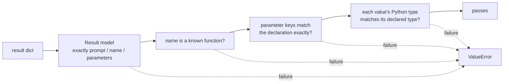

# 04 — `src/output.py`

## Role

The final safety net: check each generated call against the function schema, then
write all results to the output JSON file.

## Theory

Constrained decoding already guarantees structural validity, but a separate
**validation** step enforces the contract independently ("trust, but verify"). If
a result ever breaks the schema, we want to know — not ship it silently. One
small pydantic model checks the fixed outer shape; three plain checks cover the
parts that depend on the function definitions. Writing is done with a context
manager so the file is always closed, and `json.dump` guarantees valid,
well-escaped JSON.

## Inputs / Outputs

| | Input | Output |
|---|-------|--------|
| `validate_result(result, functions)` | one call dict + the function defs | nothing, or raises `ValueError` |
| `write_results(path, results)` | output path + list of call dicts | writes the JSON file |

## How it works

`validate_result` checks, in order (matching the subject's V.4.2 rules):

1. **Shape** — the `Result` pydantic model with `extra="forbid"`: keys are
   exactly `{prompt, name, parameters}`, `prompt` and `name` are strings,
   `parameters` is a dict. A `ValidationError` becomes a `ValueError`.
2. **Known name** — `name` must be one of the declared functions.
3. **Exact parameters** — the parameter keys must equal the declared keys
   (missing and extra parameters are both rejected).
4. **Value types** — each value is checked with `isinstance` against a small
   `type → Python types` table: `string → str`, `boolean → bool`,
   `integer`/`number → int or float`. Because `bool` is a subclass of `int` in
   Python, a boolean is rejected explicitly wherever a number is expected —
   otherwise `True` would pass as a number.

Any failure raises a `ValueError` with a precise message (e.g.
`"fn_add_numbers.a: expected number"`).

`write_results`:

1. Create the parent directory with `os.makedirs(..., exist_ok=True)` if needed.
2. Open the file with a `with` block (auto-close) and
   `json.dump(results, ..., indent=2)`, then a trailing newline.

## Why this design

- **Why validate after constrained decoding?** Defense in depth. The decoder
  *should* be correct; validation proves it and catches any future regression.
- **Why one static model + plain checks (not models generated per function)?**
  The outer shape is fixed, so one pydantic model covers it; the per-function
  parts (known name, exact keys, value types) are three obvious comparisons.
  Generating strict pydantic models per function at runtime would validate the
  same things with far more machinery.
- **Why reject `bool` for numbers explicitly?** Because `isinstance(True, int)`
  is `True` in Python; without the explicit check a boolean could sneak into a
  number field.
- **Why `json.dump` (not manual string building)?** It guarantees valid JSON and
  correct escaping (quotes, backslashes, unicode) for free.

## How to reimplement

1. Define the `Result` model (`extra="forbid"`; `prompt: str`, `name: str`,
   `parameters: Dict[str, Any]`).
2. Write `validate_result` with the four checks above; raise `ValueError` with a
   clear message on the first failure.
3. Write `write_results` to ensure the directory exists and dump the list as
   pretty JSON inside a context manager.

## Edge cases

- Output directory does not exist → created automatically.
- A bad result → `validate_result` raises; `__main__` catches it per prompt,
  prints a message, and keeps going (one bad prompt does not fail the batch).
- Write failure (permissions, disk) → `OSError`, caught in `__main__`.
