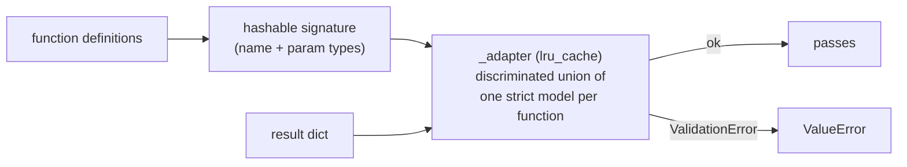

# 04 — `src/output.py`

## Role

The final safety net: check each generated call against the function schema with
strict pydantic models, then write all results to the output JSON file.

## Theory

Constrained decoding already guarantees structural validity, but a separate
**validation** step enforces the contract independently ("trust, but verify"). If
a result ever breaks the schema, we want to know — not ship it silently. Instead
of hand-written `if` checks, the function definitions are turned into **strict
pydantic models built at runtime** (`create_model`), so the same library that
validated the inputs also validates the outputs. Writing is done with a context
manager so the file is always closed, and `json.dump` guarantees valid,
well-escaped JSON.

## Inputs / Outputs

| | Input | Output |
|---|-------|--------|
| `validate_result(result, functions)` | one call dict + the function defs | nothing, or raises `ValueError` |
| `write_results(path, results)` | output path + list of call dicts | writes the JSON file |

## How it works

`_result_model(name, parameters)` builds, for one function, a strict model with
`extra="forbid"`:

- `prompt: StrictStr`
- `name: Literal[name]` — only that exact function name is accepted.
- `parameters:` a nested model with one required field per declared parameter,
  also `extra="forbid"`, so missing **and** extra parameters are both rejected.

The field types are **strict**: `StrictStr`, `StrictBool`, and
`Union[StrictInt, StrictFloat]` for `integer`/`number`. Strict types refuse
coercion — and in particular `StrictInt` rejects `True`, which plain `int` would
accept because `bool` is a subclass of `int` in Python.

`_adapter(signature)` combines the per-function models into a single validator:
a **discriminated union** on the `name` field (so pydantic picks the right model
directly and error messages stay readable). It is wrapped in `lru_cache` keyed
by the hashable signature tuple, so the models are built once per run, not once
per prompt.

`validate_result` converts the definitions to that signature tuple, runs the
adapter, and re-raises any `ValidationError` as a `ValueError` — matching the
subject's V.4.2 rules: exactly the keys `{prompt, name, parameters}`, a known
function name, exactly the declared parameters, and matching value types.

`write_results`:

1. Create the parent directory with `os.makedirs(..., exist_ok=True)` if needed.
2. Open the file with a `with` block (auto-close) and
   `json.dump(results, ..., indent=2)`, then a trailing newline.

## Why this design

- **Why validate after constrained decoding?** Defense in depth. The decoder
  *should* be correct; validation proves it and catches any future regression.
- **Why pydantic models instead of manual checks?** The subject mandates pydantic
  for data classes; building the result models from the definitions keeps one
  source of truth and gives precise error messages for free.
- **Why strict types?** Non-strict pydantic would coerce (`"42"` → `42`,
  `True` → `1`); strict types make the check mean "the decoder produced the right
  Python type", not "something convertible".
- **Why `json.dump` (not manual string building)?** It guarantees valid JSON and
  correct escaping (quotes, backslashes, unicode) for free.

## How to reimplement

1. Write a function that, given a name and its parameter types, uses
   `create_model` to build the strict result model described above.
2. Combine all function models into a `TypeAdapter` over a discriminated union
   on `name`; cache it with `lru_cache` keyed by a hashable signature.
3. Write `validate_result` to build the signature, run the adapter, and convert
   `ValidationError` to `ValueError`.
4. Write `write_results` to ensure the directory exists and dump the list as
   pretty JSON inside a context manager.

## Edge cases

- Output directory does not exist → created automatically.
- Only one function defined → the union degenerates to a single model (a
  one-member discriminated union is invalid in pydantic, so it is special-cased).
- A bad result → `validate_result` raises; `__main__` catches it per prompt,
  prints a message, and keeps going (one bad prompt does not fail the batch).
- Write failure (permissions, disk) → `OSError`, caught in `__main__`.
