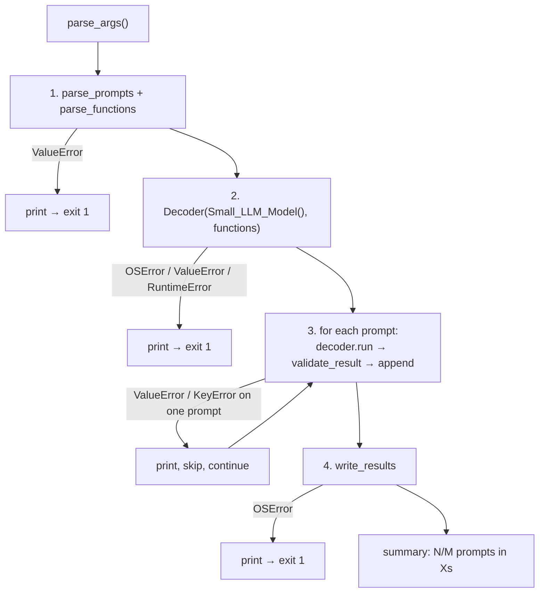

# 05 — `src/__main__.py`

## Role

The command-line entry point. It wires everything together: parse arguments, load
inputs and the model, generate a call per prompt, validate, and write the output.
This is what runs on `uv run python -m src`.

## Theory

A thin "orchestrator". It owns **program flow and error handling**, not algorithms
— each real step lives in its own module. Because it is the boundary with the
outside world (files, model, the user), it is also where we **catch errors and
exit cleanly** so the program never crashes with a raw traceback.

## Inputs / Outputs

- **Input:** three optional CLI flags (each with a default under `data/`):
  - `--functions_definition` → `data/input/functions_definition.json`
  - `--input` → `data/input/function_calling_tests.json`
  - `--output` → `data/output/function_calling_results.json`
- **Output:** the results JSON file, plus progress/summary lines on stdout and any
  error messages on stderr.

## How it works

`parse_args()` defines the three flags with `argparse`.

`main()` runs four guarded steps:

1. **Parse inputs** — `parse_prompts` + `parse_functions`. On `ValueError`, print
   it and `sys.exit(1)`.
2. **Load model & decoder** — `Decoder(Small_LLM_Model(), functions)` builds the
   vocab token sets, tries, and functions block once. On
   `OSError`/`ValueError`/`RuntimeError`, print a clear message and exit.
3. **Generate per prompt** — for each prompt: `decoder.run(prompt)`, then
   `validate_result`, then append. A `ValueError`/`KeyError` on one prompt is
   printed and **skipped**, so the batch continues.
4. **Write output** — `write_results`. On `OSError`, print and exit.

Finally it prints a summary: how many calls were produced and the elapsed time.
A `KeyboardInterrupt` at any point is caught at the very bottom so Ctrl-C exits
without a traceback.

## Why this design

- **Why keep it thin?** Separation of concerns: flow here, logic in modules. Easy
  to read top-to-bottom and easy to test the pieces independently.
- **Why catch errors per phase?** Each phase has a different meaning of failure —
  bad input vs. model load vs. one bad prompt vs. can't write — and each gets an
  appropriate message. Input/model/write failures are fatal; a single bad prompt
  is not.
- **Why defaults under `data/`?** The subject says the program reads from
  `data/input/` and writes to `data/output/` by default, with optional overrides.

## How to reimplement

1. Define the three `argparse` flags with their defaults.
2. In `main`, wrap each phase in `try/except` with a clear message and the right
   fatal/continue behavior.
3. Loop prompts: generate → validate → collect, skipping failures.
4. Write the file and print a one-line summary.

## Edge cases

- Missing/invalid input file → exit at step 1 with a clear message.
- Model fails to load (e.g. offline) → exit at step 2.
- One prompt fails → logged and skipped; others still produce output.
- Output path not writable → exit at step 4.
- Ctrl-C → clean message, no traceback.
